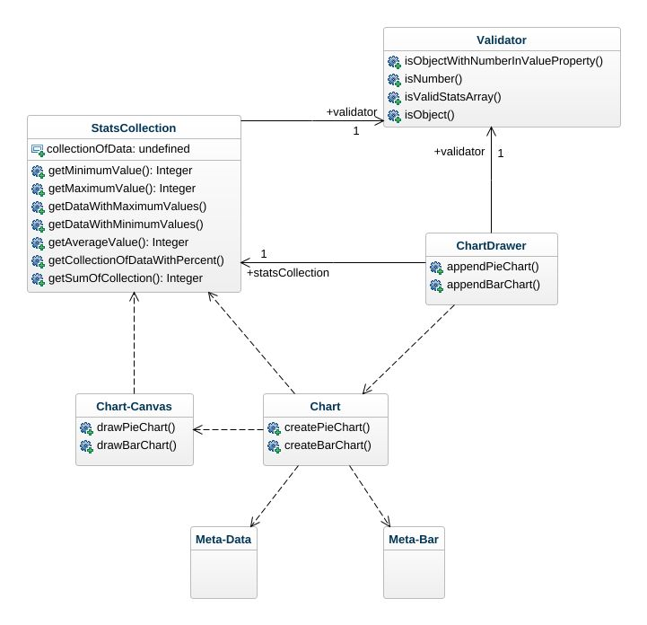

## Checklista
  - [x] Jag har skrivit all kod och reflektioner själv. Jag har inte använt mig av andras kod för att lösa uppgiften.
  - [x] Mina testresultat är skrivna utifrån utförd testning ( och inte teoretiskt: "det bör fungera" :) )
  - [x] Koden är objektorienterad
  - [x] Jag har skrivit en modul som riktar sig till programmerare
​
## Egenskattning och mål
  - [ ] Jag är inte klar eftersom jag vet att jag saknar något. (Då skall du inte lämna in! Lämna då istället in på restlaboration.)
  - [ ] Jag eftersträvar med denna inlämning godkänt betyg (E-D)
    - [ ] De flesta testfall fungerar
    - [ ] Koden är förberedd på Återanvändning
    - [ ] All kod samt historik finns i git 
    - [ ] Kodkvaliterskraven är ifyllda
    - [ ] Reflektion är skriven utifrån bokens kapitel 
  - [ ] Jag eftersträvar med denna inlämning högre betyg (C-B) och anser mig uppfylla alla extra krav för detta. 
    - [ ] Samtliga testfall är skrivna    
    - [ ] Testfall är automatiserade
    - [ ] Det finns en tydlig beskrivning i hur modulen skall användas (i git)
    - [ ] Kodkvalitetskraven är varierade 
  - [x] Jag eftersträvar med denna inlämning högsta betyg (A) 
​​
## Återanvändning
Jag gjorde ett npm-paket för enkel installation och användning av mitt paket. [Instruktioner finns här.](./package/README.md)
(Dokumentationen hittas även på [npm](https://www.npmjs.com/package/@anjson/stats-charts))
​
## Beskrivning av min kod
Min modul är en javascript-modul som består av två stycken publika klasser och ett antal klasser som utgör custom web components samt en helper-klass för att validera datatyp och hantera fel.

De publika klasserna är StatsCollection och ChartDrawer.

StatsCollection är en klass som instansieras med en array av nummer alternativt en array av objekt med ett value-attribut innehållande ett nummer. Utifrån denna samling av data kan man sedan kalla på metoder för att hämta ut medelvärde, högst/lägst värde, vilket/vilka av objekten som har det högsta/lägsta värdet med mera.

ChartDrawer instansieras med samma typ av array som StatsCollection instansieras med, då ChartDrawer bakom kulisserna skapar ett StatsCollection objekt för att beräkna data utifrån. ChartDrawer har sedan endast två publika metoder, appendPieChart och appendBarChart för att enkelt kunna visa diagram i DOM-element.

## Beroenden

**Paketet i helhet har inga externa beroenden av andra moduler eller ramverk.**

Inom paketet finns beroenden mellan ChartDrawer som har en associations-relation till StatsCollection- och Validator-klassen. 
Även StatsCollection har en associations-relation till Validator-klassen.

ChartDrawer har även en dependencie-relation till Chart-modulen som är ett custom element.

Chart-modulen och chart-canvas -modulen som båda är custom elements, har en dependencie-relation till StatsCollection för att kunna göra uträkningar på data.
​
## Hur jag testat / Testfall
Jag har har gjort både automatiska enhetstester för att kontrollera så att metoder beter sig på rätt sätt och att utdata är vad som förväntas, och manuella tester för att se att diagram visas som de ska i webbläsaren.

[Se testrapport här.](./testrapport.md)
​
​
## Kodkvalitetskrav
​​
## Namngivning

 

|   Namn och förklaring          |    Reflektion och regler från Clean Code   |
| :----------------------------- | :-------------------------------------- |
|  **collectionOfData** - attribut på *StatsCollection*-classen. |  **Make meaningful distinctions** -   *__Data__* säger inte så mycket om vad det är för något. I det här fallet så kan det vara två olika typer, en samling av objekt eller en samling av nummer. Eftersom klassen går ut på att hämta ut statistik från en samling av **data** så tycker jag ändå att namnet berättar att det är just samlingen av data.     **Dont use noice-words** -   *__of__* är ett noice-word här och jag skulle nog egentligen döpa om attributet till **dataCollection**. |
| **appendPieChart(elementId, options)** - metodnamn i *ChartDrawer*-klassen. | **Use Solution Domain Names** -   Namnet tillsammans med argumenten berättar en tydlig historia för en programmerare om vad metoden gör då append används frekvent i *solution domain*. *"The method appends a pie-chart to the element with elementId and options is available"*.     **Methods should have a verb or verb-sentence name** -   Detta är ett exempel på *__verb-sentence__* |
| **getCollectionOfDataWithPercent** - metod på *StatsCollection*-klassen. | **Use intention-revealing names** -   Namnet förklarar precis vad metoden gör och vad som returneras.     **Pick one word per concept** -   *Collection* används här och i hela klassen(även i klassens namn) för att referera till samlingen av data, även *get* används i namnet på alla publika metoder då alla metoder handlar om att läsa ut något ur samlingen. |
| **ChartDrawer** - klassnamnet på en av de två publika klasserna.  | **Dont be cute** -   *diagram ritare* skulle kunna uppfattas som ett slarvigt uttryck eller slang för att generera diagram. *__ChartGenerator__* kanske skulle vara ett mer seriöst namn. Men eftersom klassen faktiskt använder Canvas API för att rita diagram så tycker jag ändå att det är ett passande namn.     **Don't pun** -   Namnet skulle kunna tolkas som både *diagram ritare* och *diagram låda*, men eftersom målgruppen är programmerare i *problem domain* så tänker jag ändå att det är sällan man pratar om drawer som en låda i problemdomänen och att jag behåller namnet. |
| **getMaximumValue** - metod på *StatsCollection*-klassen. | **Make meaningful distinctions** -   *Value* är ett odistinkt *noice-word* som kan tyckas överflödigt. Men eftersom metoden returnerar ett enskilt maximalt värde till skillnad från klassens metod *__getDataWithMaximumValues__* som returnerar de objekt som innehåller det maximala värdet, så tycker jag namnet/namnen beskriver skillnaden bra. |

 

## Funktioner

 

|   Metodnamn och länk eller kod   |   Antal rader    |   Reflektion                   |
| :-----------------------------  | :-----------: | :-------------------------------------- |
| **drawBarChart(statsCollection, showAverage)** - metod på klassen i *chart-canvas* custom element. |  17     | **Small** -   17 rader kod är enligt boken en alldeles för lång funktion. I det här fallet handlar funktionen om att rita på canvas enligt Canvas API och då går det åt en hel del rader för att göra det enligt API:ets regler, att ställa in höjd, att flytta position för att rita på nästa ställe, att ställa in färg och att rita. Allt detta tycker jag ändå hör till samma abstraktionsnivå, att rita diagrammet.     **Do one thing** -   Även om funktionen gör en sak, ritar ett stapeldiagram, så ser jag ändå att jag skulle kunna bryta ut koden i en if-sats som kontrollerar om medelvärdet ska ritas ut till en privat *drawAveregeLine* -method som sköter själva ritandet av medelvärdet.     **Flag arguments** -   Metoden tar ett *flag argument* för att signalera om medelvärdet ska ritas ut eller inte. Ytterligare en signal på att metoden faktiskt gör mer än en sak, ritar ett diagram och ritar en medelvärdes-linje.     **Dont repeat yourself** -   Metoden anropar andra metoder på klassen för att hämta data som behövs för att göra uträkningar. |
| **#getBarAndGapWidth(statsCollection)** - privat metod på klassen i *chart-canvas* custom element. | 17 | **Use descriptive names** -   Metodnamnet beskriver vad som returneras men egentligen inget om vad som görs, här skulle kanske *calculateBarAndGapWidth(amountOfDataToIllustrate)* beskriva mer att en uträkning görs för att räkna ut bredden på staplar och bredden mellanrum baserat på den mängd data som ska illustreras görs. |
| **drawPieChart(statsCollection)** - metod på klassen i *chart-canvas* custom element. | 14 | **Small** -   Även här indikerar längden på att det kanske görs fler saker än en. Jag skulle kunna höja abstraktionsnivån och dela in funktionen mindre funktions-anrop sum utförs steg för steg. Först initiera canvas-data och sedan utföra själva ritandet.     **Argument Objects** -   Här skulle jag egentligen behöva två argument, en *summa* för att bestämma vinklarna på cirkel-diagrammet och *data* som ska ritas ut, men här hör dessa två ihop och jag bestämde mig att ta in ett objekt av *StatsCollection*-typen där jag både har samlingen av data och kan få ut summan(som hör till/beräknas på samlingen av data). |
| **generateMetaDataElements(dataCollection, options)** - Privat metod på klassen i *chart* custom element. | 11 | **Blocks and indenting** -   Här (och i alla andra metoder) applicerar jag regeln att inte ha nästlade-block av kod. I de flesta fall gör jag det genom att göra metod-anrop. Här valde jag att göra kontrollen i loopen med hjälp av *ternary expressiont* för att inte skapa ett nästlat block, och för att inte göra ytterligare en metod som i sin tur ska ta två argument för att kunna göra kontrollen. Detta resulterar i en metod på låg abstraktionsnivå med sämre *__Readability__* eftersom *ternary expressions* inte är lika tydliga/pedagogiska som ett if-block.   Så här skulle egentligen också gjort metodanrop istället för att göra kontrollen i loopen. |
| **getCollectionOfDataWithPercent** - metod på StatsCollection-klassen. | 9 | **No side effects** -   Här returneras alltså samlingen av data *(collectionOfData)* men modifierad till en samling av objekt med ytterligare ett attribut som heter percent. Detta görs utan att manipulera den samling av data som finns i *collectionOfData*-attributet. Alltså utan sido-effekter. |

 

## Reflektion

Jag gick in i uppgiften efter att ha läst kapitlen om namngivning och funktioner i boken Clean Code, med de regler som boken beskriver i ryggen försökte jag skriva min kod så tydlig som möjligt och följa de regler som tas upp. Några regler med namngivning tycker jag ändå att jag har följt sedan tidigare utan att egentligen vetat om att det är en regel, just för att det har hjälpt mig att förstå min kod när jag läser den nästa vecka eller nästa månad. Då har jag applicerat regler som *intention-revealing names*, *pronounceable names*, *searchable names*, *avoid encodings* och *dont be cute*. Jag fick däremot tänka till lite när det gäller *avoid noice words* och *make meaningful distinctions* då jag märkte att jag ibland lägger till onödiga ord i namnen som inte gör det tydligare. Jag insåg att jag ibland använder mig av en typ av *hungarian notation* och döper variabler till namn innehållande datatypen, tex *nameArray* eller *personObject*.

Även regler för funktioner har vi jobbat en del med sedan år 1 när det gäller tex *no side ffects*, *prefer exceptions*, *dont repeat yourself* och *use descriptive names*.
Men regeln att funktioner inte ska innehålla nästlade block av kod utan endast ska ha en indetion, ledde genast till mer tydlig kod kände jag. Det kändes som en extrem regel och det finns såklart undantag när det blir overkill att bryta ut block av kod i nya funktioner, men detta hjälpte verkligen till att uppnå målet i andra regler. Tex att funktioner bara gör en sak *(do one thing)*, inte är för långa *(small)*, antingen utför en handling eller läser information *(command query separation)* och får ett beskrivande namn *(use descriptive names)*.

Nu valde jag att göra två klasser för det publika interfacet istället för att skapa en fasad-klass, detta gjorde att jag har en lägre abstraktionsnivå på hela StatsCollection-klassen mot vad jag hade fått om jag hade gjort en fasad-klass som endast gör metod-anrop på de övriga klasserna. Men jag tycker ändå att det blev tydligare att ha två stycken klasser i modulen då de gör helt olika saker och i ChartDrawer-klassen kunde jag bygga det publika interfacet med högre abstraktionsnivå. Det känns tydligare för användaren av min modul att om jag importerar *StatsCollection* så kan jag läsa ut statistik(vilket i sig självt är på en ganska låg abstraktionsnivå) och importerar jag *ChartDrawer* så kan jag rita diagram.

Att hålla nere antal argument gjorde också koden mycket tydligare och genom att lägga metoder på en klass för att hämta data inom klassen är mer tydligt än att skicka data som ett argument till en funktion, det leder också till seperation of concern och ger en behagligare upplevelse för användaren av metoden. Användaren behöver inte vet HUR det går till att hämta data om man skriver `statsCollection.getMaximumValue()`, däremot om koden hade skrivits `getMaximumValue(collectionOfData)` då behöver användaren veta hur strukturen på data ska vara för att ett värde ska kunna hämtas.

Jag tänker att vissa regler i boken må vara extrema, som att funktioner bara får vara 5-6 rader och bara ha en indention, men att ha dem i bakhuvudet och implementera dem så långt det är möjligt som jag har försökt göra har gjort att jag har fått fundera på vad funktionen egentligen gör, är det bara en sak som görs eller behöver funktionen brytas ner i fler mindre funktioner. Dessutom blir koden mer lättläst och lättförstålig. När jag även kände att jag greppade det här med abstraktionsnivåer och att en funktion endast ska innehålla samma abstraktionsnivå så underlättade det också själva uppdelandet av mindre funktioner som bara gör en sak.
