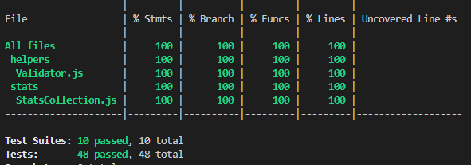

# Test report


## Automatic unit-tests

### Whats tested and how?

The StatsCollection-class and its dependencie-class Validator is tested with the use of Jest.
To run the automatic unit-test:

```javascript
  cd package
  npm run test
```

### __Coverage__



<br>

### __Test-Suites__

<details>

<summary>

#### side-effects

</summary>

```javascript
describe('side-effects', () => {
  describe('get data', () => {
    it('accessing collectionOfData-property should return a copy of the original data', () => {
      const data = [10, 12]
      const statsCollection = new StatsCollection(data)
      expect(statsCollection.collectionOfData).not.toBe(data)
    })
  })
})
```

</details>

<details>

<summary>

#### constructor()

</summary>

```javascript
describe('instance', () => {
  describe('create instance', () => {
    it(`passing [{ value: 25 }, 20, { value: 13 }] should throw TypeError with the custom message '${ERROR_MESSAGE_NOT_VALID_COLLECTION}'`, () => {
      const data = [{ value: 25 }, 20, { value: 13 }]

      expect(() => {
        const statsCollection = new StatsCollection(data)
      }).toThrow(new TypeError(ERROR_MESSAGE_NOT_VALID_COLLECTION))
    })

    it(`passing [{ name: 'Ada' }, { value: 13 }] should throw TypeError with the custom message '${ERROR_MESSAGE_NOT_VALID_COLLECTION}'`, () => {
      const data = [{ name: 'Ada' }, { value: 13 }]

      expect(() => {
        const statsCollection = new StatsCollection(data)
      }).toThrow(new TypeError(ERROR_MESSAGE_NOT_VALID_COLLECTION))
    })

    it(`passing [20, '13'] should throw TypeError with the custom message '${ERROR_MESSAGE_NOT_VALID_COLLECTION}'`, () => {
      const data = [20, '13']

      expect(() => {
        const statsCollection = new StatsCollection(data)
      }).toThrow(new TypeError(ERROR_MESSAGE_NOT_VALID_COLLECTION))
    })

    it(`passing 20 should throw TypeError with the custom message '${ERROR_MESSAGE_NOT_VALID_COLLECTION}'`, () => {
      const data = 20

      expect(() => {
        const statsCollection = new StatsCollection(data)
      }).toThrow(new TypeError(ERROR_MESSAGE_NOT_VALID_COLLECTION))
    })

    it(`passing [20, -10] should throw TypeError with the custom message '${ERROR_MESSAGE_NOT_VALID_COLLECTION}'`, () => {
      const data = [20, -10]

      expect(() => {
        const statsCollection = new StatsCollection(data)
      }).toThrow(new TypeError(ERROR_MESSAGE_NOT_VALID_COLLECTION))
    })

    it(`passing [{ value: 20 }, { value: -10 }] should throw TypeError with the custom message '${ERROR_MESSAGE_NOT_VALID_COLLECTION}'`, () => {
      const data = [{ value: 20 }, { value: -10 }]

      expect(() => {
        const statsCollection = new StatsCollection(data)
      }).toThrow(new TypeError(ERROR_MESSAGE_NOT_VALID_COLLECTION))
    })

    it('passing [20, 100] should NOT throw a TypeError', () => {
      const data = [20, 100]

      expect(() => {
        const statsCollection = new StatsCollection(data)
      }).not.toThrow(new TypeError())
    })

    it('passing [{ value: 100 }, { value: 12 }] should NOT throw a TypeError', () => {
      const data = [{ value: 100 }, { value: 12 }]

      expect(() => {
        const statsCollection = new StatsCollection(data)
      }).not.toThrow(new TypeError())
    })
  })
})
```

</details>

<details>

<summary>

#### getAverageValue()

</summary>

```javascript
describe('average', () => {
  describe('return value', () => {
    it('from a collection of [10, 12, 8, 2] the method should return 8', () => {
      const data = [10, 12, 8, 2]
      const statsCollection = new StatsCollection(data)
      expect(statsCollection.getAveregeValue()).toBe(8)
    })

    it('from a collection of [{ value: 10 }, { value: 8 }, { value: 3}] the method should return 7', () => {
      const data = [{ value: 10 }, { value: 8 }, { value: 3 }]
      const statsCollection = new StatsCollection(data)
      expect(statsCollection.getAveregeValue()).toBe(7)
    })
  })
})
```

</details>

<details>

<summary>

#### getCollectionOfDataWithPercent()

</summary>

```javascript
describe('collection with percent', () => {
  describe('return value', () => {
    it('from a collection of [10, 12, 3, 18] the method should return [{ value: 10, percent: 0.23255813953488372 }, { value: 12, percent: 0.27906976744186046 }, { value: 3, percent: 0.06976744186046512 }, { value: 18, percent: 0.4186046511627907 }]', () => {
      const data = [10, 12, 3, 18]
      const statsCollection = new StatsCollection(data)
      expect(statsCollection.getCollectionOfDataWithPercent()).toEqual([{ value: 10, percent: 0.23255813953488372 }, { value: 12, percent: 0.27906976744186046 }, { value: 3, percent: 0.06976744186046512 }, { value: 18, percent: 0.4186046511627907 }])
    })

    it('from a collection of [{ title: "a", value: 10 }, { title: "b", value: 12 }, { title: "c", value: 3 }, { title: "d", value: 18 }] the method should return [{ percent: 0.23255813953488372, title: "a", value: 10 }, { percent: 0.27906976744186046, title: "b", value: 12 }, { percent: 0.06976744186046512, title: "c", value: 3 }, { percent: 0.4186046511627907, title: "d", value: 18 }]', () => {
      const data = [{ title: 'a', value: 10 }, { title: 'b', value: 12 }, { title: 'c', value: 3 }, { title: 'd', value: 18 }]
      const statsCollection = new StatsCollection(data)
      expect(statsCollection.getCollectionOfDataWithPercent()).toEqual([{ percent: 0.23255813953488372, title: 'a', value: 10 }, { percent: 0.27906976744186046, title: 'b', value: 12 }, { percent: 0.06976744186046512, title: 'c', value: 3 }, { percent: 0.4186046511627907, title: 'd', value: 18 }])
    })
  })
})
```

</details>

<details>

<summary>

#### getDataWithMaximumValues()

</summary>

```javascript
describe('data with maximum', () => {
  describe('return value', () => {
    it('from a collection of [10, 12, 3, 18] the method should return [18]', () => {
      const data = [10, 12, 3, 18]
      const statsCollection = new StatsCollection(data)
      expect(statsCollection.getDataWithMaximumValues()).toEqual([18])
    })

    it('from a collection of [10, 12, 3, 13, 13] the method should return [13, 13]', () => {
      const data = [10, 12, 3, 13, 13]
      const statsCollection = new StatsCollection(data)
      expect(statsCollection.getDataWithMaximumValues()).toEqual([13, 13])
    })

    it('from a collection of [{ value: 1 }, { value: 3 }] the method should return [{ value: 3 }]', () => {
      const data = [{ value: 1 }, { value: 3 }]
      const statsCollection = new StatsCollection(data)
      expect(statsCollection.getDataWithMaximumValues()).toEqual([{ value: 3 }])
    })

    it('from a collection of [{ title: "a", value: 10 }, { title: "b", value: 3 }, { title: "c", value: 10 }] the method should return [{ title: "a", value: 10 }, { title: "c", value: 10 }]', () => {
      const data = [{ title: 'a', value: 10 }, { title: 'b', value: 3 }, { title: 'c', value: 10 }]
      const statsCollection = new StatsCollection(data)
      expect(statsCollection.getDataWithMaximumValues()).toEqual([{ title: 'a', value: 10 }, { title: 'c', value: 10 }])
    })
  })
})
```

</details>

<details>

<summary>

#### getMaximumValue()

</summary>

```javascript
describe('maximum', () => {
  describe('return value', () => {
    it('from a collection of [10, 12, 3, 18] the method should return 18', () => {
      const data = [10, 12, 3, 18]
      const statsCollection = new StatsCollection(data)
      expect(statsCollection.getMaximumValue()).toBe(18)
    })

    it('from a collection of [{ value: 10 }, { value: 20 }] the method should return 20', () => {
      const data = [{ value: 10 }, { value: 20 }]
      const statsCollection = new StatsCollection(data)
      expect(statsCollection.getMaximumValue()).toBe(20)
    })
  })
})
```

</details>

<details>

<summary>

#### getDataWithMinimumValues()

</summary>

```javascript
describe('data with minimum', () => {
  describe('return value', () => {
    it('from a collection of [10, 12, 3, 18] the method should return [3]', () => {
      const data = [10, 12, 3, 18]
      const statsCollection = new StatsCollection(data)
      expect(statsCollection.getDataWithMinimumValues()).toEqual([3])
    })

    it('from a collection of [10, 12, 3, 13, 3] the method should return [3, 3]', () => {
      const data = [10, 12, 3, 13, 3]
      const statsCollection = new StatsCollection(data)
      expect(statsCollection.getDataWithMinimumValues()).toEqual([3, 3])
    })

    it('from a collection of [{ value: 1 }, { value: 3 }] the method should return [{ value: 1 }]', () => {
      const data = [{ value: 1 }, { value: 3 }]
      const statsCollection = new StatsCollection(data)
      expect(statsCollection.getDataWithMinimumValues()).toEqual([{ value: 1 }])
    })

    it('from a collection of [{ title: "a", value: 10 }, { title: "b", value: 3 }, { title: "c", value: 3 }] the method should return [{ title: "b", value: 3 }, { title: "c", value: 3 }]', () => {
      const data = [{ title: 'a', value: 10 }, { title: 'b', value: 3 }, { title: 'c', value: 3 }]
      const statsCollection = new StatsCollection(data)
      expect(statsCollection.getDataWithMinimumValues()).toEqual([{ title: 'b', value: 3 }, { title: 'c', value: 3 }])
    })
  })
})
```

</details>

<details>

<summary>

#### getMinimumValue()

</summary>

```javascript
describe('minimum', () => {
  describe('return value', () => {
    it('from a collection of [10, 12, 3, 18] the method should return 3', () => {
      const data = [10, 12, 3, 18]
      const statsCollection = new StatsCollection(data)
      expect(statsCollection.getMinimumValue()).toBe(3)
    })

    it('from a collection of [{ value: 10 }, { value: 20 }] the method should return 10', () => {
      const data = [{ value: 10 }, { value: 20 }]
      const statsCollection = new StatsCollection(data)
      expect(statsCollection.getMinimumValue()).toBe(10)
    })
  })
})
```

</details>

<details>

<summary>

#### getSumOfCollection()

</summary>

```javascript
describe('sum', () => {
  describe('return value', () => {
    it('from a collection of [10, 12, 3, 18] the method should return 43', () => {
      const data = [10, 12, 3, 18]
      const statsCollection = new StatsCollection(data)
      expect(statsCollection.getSumOfCollection()).toBe(43)
    })

    it('from a collection of [{ value: 10 }, { value: 20 }] the method should return 30', () => {
      const data = [{ value: 10 }, { value: 20 }]
      const statsCollection = new StatsCollection(data)
      expect(statsCollection.getSumOfCollection()).toBe(30)
    })
  })
})
```

</details>

<details>

<summary>

#### Validator

</summary>

```javascript
// ------------------------------------------------------------------------------
//  valid object
// ------------------------------------------------------------------------------
describe('valid object', () => {
  describe('return value', () => {
    it('should return true when argument is { value: 12 }', () => {
      const validator = new Validator()
      expect(validator.isObjectWithPositiveNumberInValueProperty({ value: 12 })).toBe(true)
    })

    it('should return false when argument is 12', () => {
      const validator = new Validator()
      expect(validator.isObjectWithPositiveNumberInValueProperty(12)).toBe(false)
    })

    it('should return false when argument is { value: "12" }', () => {
      const validator = new Validator()
      expect(validator.isObjectWithPositiveNumberInValueProperty({ value: '12' })).toBe(false)
    })

    it('should return false when argument is { value: NaN }', () => {
      const validator = new Validator()
      expect(validator.isObjectWithPositiveNumberInValueProperty({ value: NaN })).toBe(false)
    })
  })
})

// ------------------------------------------------------------------------------
//  positive number
// ------------------------------------------------------------------------------
describe('positive number', () => {
  describe('return value', () => {
    it('should return true when argument is 1', () => {
      const validator = new Validator()
      expect(validator.isPositiveNumber(1)).toBe(true)
    })

    it('should return true when argument is 0', () => {
      const validator = new Validator()
      expect(validator.isPositiveNumber(0)).toBe(true)
    })

    it('should return false when argument is -2', () => {
      const validator = new Validator()
      expect(validator.isPositiveNumber(-2)).toBe(false)
    })

    it('should return false when argument is "10"', () => {
      const validator = new Validator()
      expect(validator.isPositiveNumber('10')).toBe(false)
    })

    it('should return false when argument is NaN', () => {
      const validator = new Validator()
      expect(validator.isPositiveNumber(NaN)).toBe(false)
    })
  })
})

// ------------------------------------------------------------------------------
//  valid stats array
// ------------------------------------------------------------------------------
describe('valid stats array', () => {
  describe('return value', () => {
    it('should return false when argument is [{ value: 25 }, 20, { value: 13 }]', () => {
      const validator = new Validator()
      expect(validator.isValidStatsArray([{ value: 25 }, 20, { value: 13 }])).toBe(false)
    })

    it('should return false when argument is [{ name: "Ada" }, { value: 13 }]', () => {
      const validator = new Validator()
      expect(validator.isValidStatsArray([{ name: 'Ada' }, { value: 13 }])).toBe(false)
    })

    it('should return false when argument is [20, "13"]', () => {
      const validator = new Validator()
      expect(validator.isValidStatsArray([20, '13'])).toBe(false)
    })

    it('should return false when argument is 20', () => {
      const validator = new Validator()
      expect(validator.isValidStatsArray(20)).toBe(false)
    })

    it('should return false when argument is [20, -10]', () => {
      const validator = new Validator()
      expect(validator.isValidStatsArray([20, -10])).toBe(false)
    })

    it('should return false when argument is [{ value: 20 }, { value: -10 }]', () => {
      const validator = new Validator()
      expect(validator.isValidStatsArray([{ value: 20 }, { value: -10 }])).toBe(false)
    })

    it('should return true when argument is [20, 100]', () => {
      const validator = new Validator()
      expect(validator.isValidStatsArray([20, 100])).toBe(true)
    })

    it('should return true when argument is [{ value: 100 }, { value: 12 }]', () => {
      const validator = new Validator()
      expect(validator.isValidStatsArray([{ value: 100 }, { value: 12 }])).toBe(true)
    })
  })
})

// ------------------------------------------------------------------------------
//  object
// ------------------------------------------------------------------------------
describe('object', () => {
  describe('return value', () => {
    it('should return true when argument is {}', () => {
      const validator = new Validator()
      expect(validator.isObject({})).toBe(true)
    })

    it('should return true when argument is { title: "a" }', () => {
      const validator = new Validator()
      expect(validator.isObject({ title: 'a' })).toBe(true)
    })

    it('should return false when argument is [{ value: 13 }]', () => {
      const validator = new Validator()
      expect(validator.isObject([{ value: 13 }])).toBe(false)
    })

    it('should return false when argument is null', () => {
      const validator = new Validator()
      expect(validator.isObject(null)).toBe(false)
    })
  })
})
```

</details>
